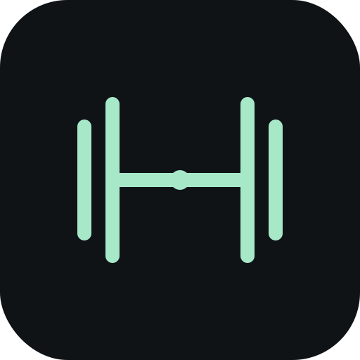

<p align="center">
  
</p>

<h1 align="center">Gym Track</h1>

<p align="center">
  <strong>L'app fitness Social-First propulsée par l'IA.</strong><br/>
  Suis ta progression, partage tes performances, et reçois les conseils de <strong>Stéphane</strong>, ton coach IA personnel.
</p>

<p align="center">
  <a href="https://gym-track-landing-2iys.vercel.app/">Site vitrine </a>
</p>

<p align="center">
  <a href="https://gabrielorsatti.github.io/Personnal-gym-tracker/">Essayer l'application</a>
</p>

---

## Qu'est-ce que Gym Track ?

Gym Track est une application de fitness complète conçue pour les sportifs qui veulent un suivi intelligent sans friction. Décris ta séance en langage naturel, et l'IA la structure automatiquement. Publie tes entraînements sur un flux social inspiré de Strava, et laisse Stéphane, ton coach IA, analyser chaque séance avec un regard de professionnel.

---

## Fonctionnalités

📱 **PWA installable** : Ajoute Gym Track sur ton écran d'accueil (iOS & Android)

🏋️ **Saisie en langage naturel** : Écris « 4×10 DC 80kg, tractions 3×8 +10 » et l'IA structure tout

📊 **Progression détaillée** : Graphiques de volume, records personnels, courbes par exercice, suivi cardio

🤖 **Coach Stéphane** : Analyse critique et intelligente de tes séances (reconnaît ton split PPL, Upper/Lower, Full Body)

🔥 **Flux social type Strava** : Publie tes séances, reçois des Kudos, commente les performances de tes amis

👤 **Profils avec photos** : Avatar, stats publiques, historique de séances publiées navigable

🔔 **Notifications temps réel** : Likes, commentaires, demandes d'amis

🍗 **Suivi nutrition** : Saisie libre analysée par IA, dashboard macros, historique 14 jours

🌱 **Dashboard Green IT** : Transparence totale sur l'impact carbone de tes prompts (sourcé ADEME, Luccioni et al.)

📚 **Catalogue d'exercices** : Plus de 100 mouvements avec tips techniques d'expert par exercice

🎨 **Thème Mauve & Blanc** : Design moderne avec mode sombre, adapté mobile

---

## Comment utiliser Gym Track

### 1. Créer un compte

Ouvre l'app et inscris-toi avec ton email. Choisis un pseudo unique, c'est ce que tes amis verront !

### 2. Enregistrer ta première séance

Va dans l'onglet **Training** et décris ta séance en français dans la zone de texte :

```
J'ai fait 20 tractions puis 30 crunch abdos
DC 4×10 80kg
Développé incliné haltères 3×12 28kg
Dips 3×15
Pushdown corde 4×12 25kg
```

L'IA parse (reconnaît et traduit) automatiquement tes exercices. Valide, et c'est enregistré.

### 3. Publier et interagir

Après ta séance, clique **Terminer ma séance** → choisis de la publier sur le flux social. Tes amis pourront te donner un Kudo ou commenter.

### 4. Ajouter des amis

Dans l'onglet **Social**, recherche un pseudo et envoie une demande. Une fois acceptée, vous voyez mutuellement vos séances publiées.

### 5. Consulter Stéphane

L'onglet **Coach** te donne accès à Stéphane : pose-lui des questions sur tes charges, ta programmation, ou demande-lui un programme personnalisé.

---

## Tech Stack

| Couche | Technologie |
|--------|-------------|
| Frontend | React 18 · TypeScript · Tailwind CSS 3 |
| Build | Vite 6 · PWA (Workbox) |
| Backend | Supabase (PostgreSQL + Auth + Storage) |
| IA | LLM (Llama 3.3 / Mistral Small) |
| Déploiement | GitHub Actions → GitHub Pages |

---

## Captures

L'application est accessible en ligne. Crée un compte pour explorer toutes les fonctionnalités.

---

## Auteur

Développé par **Gabriel Orsatti**, 2026.

---

## Licence

```
© 2026 Gym Track — All Rights Reserved.

Ce code est public pour consultation uniquement.
Toute reproduction, modification ou redistribution
sans autorisation écrite est strictement interdite.
```
